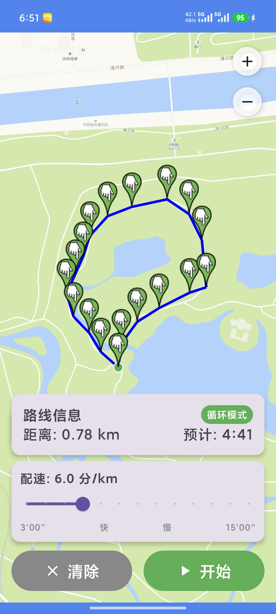

# 虚拟跑步 (VirtualRun)

一款免 Root 的 Android 虚拟跑步定位 App，支持在地图上规划路线并模拟真实跑步。无需任何 API Key，国内网络直连即可使用。

## 功能特性

- **免 Root**：使用 Android 标准 Mock Location API，无需 Root 权限
- **国内直连地图**：内置腾讯地图瓦片源，无需 VPN，无需 API Key，开箱即用
- **地图选点**：在地图上点击设置起点、途经点和终点
- **绕圈循环跑**：再次点击起点标记即可闭合路线，支持无限循环跑步
- **配速调节**：可调节跑步配速（3-15 分钟/公里）
- **实时调速**：跑步过程中可随时调整配速，即时生效
- **速度扰动**：自动添加 ±15% 随机波动，模拟真实跑步的自然速度变化
- **路线偏离模拟**：每隔 5-10 秒随机偏离路线 0.5-3 米，持续 2-5 秒后回归，更贴近真人跑步轨迹
- **轨迹平滑**：Catmull-Rom 样条插值 + 位置平滑，路线流畅自然
- **后台保活**：前台服务 + 唤醒锁，APP 后台或锁屏时虚拟定位持续生效
- **实时进度**：显示路线距离、预计用时、跑步进度和当前配速

## 截图


*地图选点、路线规划与循环跑步*

## 下载安装

**[>>> 点击下载最新版 APK <<<](../../raw/main/release/VirtualRun-v1.1.0.apk)**

或者在 [release 目录](release/) 中查看所有版本。

## 使用方法

### 1. 安装与设置

1. 下载上方 APK 并安装到 Android 手机
2. 打开应用，授予**位置权限**和**通知权限**
3. 进入 **设置 → 系统 → 开发者选项 → 选择模拟位置信息应用**，选择「虚拟跑步」

> **提示**：如果找不到开发者选项，进入「关于手机」连续点击「版本号」7 次即可开启。

### 2. 规划路线

1. 在地图上点击设置**起点**（显示为绿色标记）
2. 继续点击添加**途经点**（显示为蓝色标记）
3. 点击设置**终点**（显示为红色标记）
4. **闭合路线**：再次点击**起点标记**，自动连接最后一个点与起点，形成闭环，支持循环跑步

### 3. 开始虚拟跑步

1. 拖动底部滑块设置目标配速（3-15 分/公里）
2. 点击「开始」按钮启动虚拟定位
3. 跑步过程中可随时拖动滑块**实时调整配速**
4. 点击「停止」结束虚拟定位

> **注意**：开始跑步后，即使返回桌面或锁屏，虚拟定位仍会继续运行。

## 构建项目

### 环境要求

- JDK 17+
- Android SDK (API 34)
- Android Studio Arctic Fox 或更高版本

### 构建命令

```bash
./gradlew assembleDebug
```

APK 将生成在 `app/build/outputs/apk/debug/app-debug.apk`

## 项目结构

```
app/src/main/java/com/virtualrun/app/
├── MainActivity.kt                 # 主 Activity，权限请求与 osmdroid 初始化
├── model/
│   └── RoutePoint.kt               # 数据模型（路线点、路线、运动状态）
├── service/
│   └── MockLocationService.kt      # Mock Location 前台服务（核心功能）
├── algorithm/
│   └── TrajectoryInterpolator.kt   # 轨迹插值、平滑与速度扰动算法
├── ui/
│   ├── MainViewModel.kt            # 状态管理与业务逻辑
│   ├── NoMapScreen.kt              # 无地图时的备用界面
│   └── OSMapScreen.kt              # osmdroid 地图界面
└── map/
    ├── ChinaMapTileSource.kt       # 腾讯地图瓦片源
    └── MapType.kt                  # 坐标转换（GCJ-02 ↔ WGS-84）
```

## 技术栈

- **语言**：Kotlin
- **UI 框架**：Jetpack Compose + Material 3
- **地图**：osmdroid + 腾讯地图瓦片源（国内直连，无需 API Key）
- **架构**：MVVM
- **异步**：Kotlin Coroutines + Flow
- **最低版本**：Android 8.0 (API 26)

## 核心技术实现

### Mock Location Service
- 前台服务保活，确保 APP 后台时定位持续生效
- 同时模拟 `GPS_PROVIDER`、`NETWORK_PROVIDER` 和 `fused` 三个定位源
- 补全海拔、精度、方位角、卫星数量等字段，提高模拟真实性
- 以 1Hz 频率发送虚拟位置数据

### 轨迹插值算法
- Catmull-Rom 样条插值生成密集平滑点
- 位置平滑（0.35）和航向平滑（0.25），避免抖动
- 速度扰动：随机 ±8% + 正弦波 ±10%，总波动约 ±15%
- 路线偏离：每隔 5-10 秒随机偏离 0.5-3 米，持续 2-5 秒后回归

## 注意事项

1. **模拟位置权限**：使用前必须在开发者选项中将本应用设置为模拟位置应用，否则虚拟定位不会生效
2. **后台限制**：部分国产 ROM（小米、华为等）可能会限制后台服务，如遇后台停止，请将本应用加入电池优化白名单或允许后台运行
3. **检测风险**：某些应用可能会检测到使用了 Mock Location，请自行承担使用风险
4. **坐标精度**：地图使用 GCJ-02 坐标系，虚拟定位自动转换为 WGS-84 发送给系统

## 开源协议

[MIT License](LICENSE)

## 免责声明

本应用仅供学习和测试使用，请勿用于违反服务条款的用途。使用本应用产生的任何后果由用户自行承担。

## 贡献

欢迎提交 Issue 和 Pull Request！

## 更新日志

### v1.1.0 (2026-04-21)
- 地图改为腾讯地图瓦片源，国内直连无需 API Key
- 新增绕圈循环跑功能
- 新增跑步中实时调速
- 新增路线偏离模拟，轨迹更自然
- 新增轨迹平滑（Catmull-Rom 插值）
- 修复后台定位失效问题
- 修复坐标转换精度问题

### v1.0.0 (2026-03-10)
- 初始版本发布
- 实现基础地图选点和路线规划
- 实现 Mock Location 核心功能
- 实现轨迹插值和速度扰动算法
