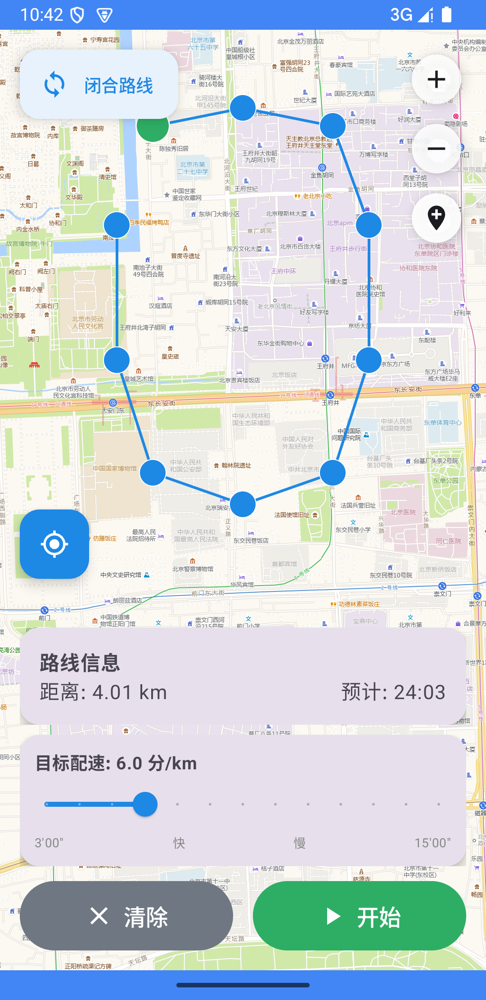

# 虚拟跑步 (VirtualRun)

一款免 Root 的 Android 虚拟跑步定位 App，支持在地图上规划路线并生成更接近真人跑步的连续轨迹。无需任何 API Key，国内网络直连即可使用。

当前版本：**v1.0.2** · 最低支持 Android 8.0（API 26）

## 功能特性

- **免 Root**：使用 Android 标准 Mock Location API，无需 Root 权限
- **国内直连地图**：内置高德地图瓦片源，无需 VPN，无需 API Key，开箱即用
- **高倍地图缩放**：原生瓦片保持在稳定的 `z18`，通过本地超采样继续放大到 `z22`，避免高倍缩放后地图空白
- **地图选点**：在地图上点击设置起点、途经点和终点
- **绕圈循环跑**：再次点击起点标记即可闭合路线，支持无限循环跑步
- **自然绕圈轨迹**：闭环路线使用定长圆角，并加入每圈轻微内外偏移，避免生硬折线和机械重合
- **定位偏移修正**：在中国地图上点击定位时，自动将系统 WGS-84 坐标转换为 GCJ-02 显示，避免地图偏移
- **配速调节**：可调节跑步配速（3-15 分钟/公里）
- **快速调速**：起跑后快速跟上目标配速；跑步过程中修改目标配速会在下一次采样附近完成响应
- **稳定速度范围**：稳定跑动时，报告速度和相邻轨迹推导速度均限制在目标速度的 ±15% 范围内
- **自然速度扰动**：使用连续、相关的低频与高频波动，避免逐秒随机跳变
- **立即停止**：点击停止后立即结束模拟定位，不再经历“平稳停止”或缓慢减速过程
- **异常配速保护**：低速和停止状态不再显示数百分钟每公里的失真配速
- **轨迹平滑**：闭环和开放路线均采用定长圆角与等距离重采样，路线连续自然
- **后台保活**：前台服务 + 唤醒锁，APP 后台或锁屏时虚拟定位持续生效
- **跑步软件兼容**：同时覆盖 Android 系统定位和 Google Play 融合定位，跑步软件切换到高精度记录后仍可持续收到移动轨迹
- **实时进度**：显示路线距离、预计用时、跑步进度和当前配速

## 截图


*最新版八点闭环路线规划界面*

## 下载安装

**[>>> 点击下载 VirtualRun v1.0.2 APK <<<](https://github.com/uinaqx/VirtualGPS-Run---MAX/releases/download/v1.0.2/VirtualRun-v1.0.2.apk)**

也可以前往 [GitHub Releases](https://github.com/uinaqx/VirtualGPS-Run---MAX/releases/latest) 查看最新版本和更新说明。

- APK 版本：`1.0.2`（versionCode 3）
- SHA-256：`54CFA2294B71C9ED21AC53633B00B45C819F09C9303B494D6CDD759391409F68`

> 当前 APK 使用 Android Debug 签名，可直接安装测试；项目尚未配置用于应用商店发布的正式签名密钥。

## 使用方法

### 1. 安装与设置

1. 下载上方 APK 并安装到 Android 手机
2. 打开应用，授予**位置权限**和**通知权限**
3. 进入 **设置 → 系统 → 开发者选项 → 选择模拟位置信息应用**，选择「虚拟跑步」

> **提示**：如果找不到开发者选项，进入「关于手机」连续点击「版本号」7 次即可开启。

### 2. 规划路线

1. 在地图上点击设置**起点**（显示为绿色标记）
2. 继续点击添加**途经点**（显示为蓝色标记）
3. 根据需要继续添加途经点和终点
4. **闭合路线**：再次点击起点，或点击左上角「闭合路线」，自动连接最后一点与起点并进入循环模式

> **轨迹提示**：闭环路线开始跑步后，实际虚拟轨迹会自动圆角化，并在每圈加入轻微自然漂移，不会完全机械地贴着手动画出的折线跑。

### 3. 开始虚拟跑步

1. 拖动底部滑块设置目标配速（3-15 分/公里）
2. 点击「开始」按钮启动虚拟定位
3. 跑步过程中可随时拖动滑块**快速调整配速**
4. 点击「停止」后会立即结束虚拟定位并清除模拟定位服务

> **注意**：开始跑步后，即使返回桌面或锁屏，虚拟定位仍会继续运行。

## 构建项目

### 环境要求

- JDK 17+
- Android SDK (API 34)
- Android Studio Arctic Fox 或更高版本

### 构建命令

```bash
./gradlew testDebugUnitTest lintDebug assembleDebug
```

APK 将生成在 `app/build/outputs/apk/debug/app-debug.apk`

## 项目结构

```
app/src/main/java/com/virtualrun/app/
├── MainActivity.kt                 # 主 Activity，权限请求与 osmdroid 初始化
├── model/
│   └── RoutePoint.kt               # 数据模型（路线点、路线、运动状态）
├── service/
│   └── MockLocationService.kt      # Mock Location 前台服务（核心功能）
├── algorithm/
│   └── TrajectoryInterpolator.kt   # 定长圆角、等距重采样、自然漂移与速度控制算法
├── ui/
│   ├── MainViewModel.kt            # 状态管理与业务逻辑
│   └── OSMapScreen.kt              # osmdroid 地图界面与中国地图定位偏移修正
└── map/
    ├── ChinaMapTileSource.kt       # 高德地图瓦片源与原生缩放上限
    └── CoordinateConverter.kt      # 坐标转换（GCJ-02 ↔ WGS-84）
```

## 技术栈

- **语言**：Kotlin
- **UI 框架**：Jetpack Compose + Material 3
- **地图**：osmdroid + 高德地图瓦片源（国内直连，无需 API Key）
- **架构**：MVVM
- **异步**：Kotlin Coroutines + Flow
- **最低版本**：Android 8.0 (API 26)

## 核心技术实现

### Mock Location Service
- 前台服务保活，确保 APP 后台时定位持续生效
- 同时模拟 `GPS_PROVIDER`、`NETWORK_PROVIDER` 和系统 `fused` 三个定位源
- 显式启用 Google Play `FusedLocationProviderClient` mock 模式，兼容跑步软件开始记录后的高精度融合定位请求
- 补全海拔、精度、方位角、卫星数量等字段，提高模拟真实性
- 以 1Hz 频率发送虚拟位置数据

### 轨迹插值算法
- 路线圆角：仅在顶点附近使用固定距离圆角，避免长路段被切成不自然的大圆弧
- 距离重采样：按约 3 米的固定间隔生成密集轨迹点，减少不同路段速度不均
- 自然绕圈：每圈加入轻微内外偏移，并叠加连续横向漂移，避免轨迹机械重合
- 速度扰动：使用均值回归的相关噪声生成连续变化，稳定阶段不超过目标速度 ±15%
- 快速响应：起跑和用户主动修改配速使用独立的快速响应控制，弯道和自然终点仍保留平滑变化
- 时间推进：使用单调时钟与 100ms 内部积分步长，降低后台调度延迟造成的速度失真
- GNSS 观测：缓慢变化海拔、精度、方位角精度和卫星数量，并限制相邻观测点的异常速度

### 中国地图坐标修正
- 地图瓦片使用 GCJ-02 坐标系
- 虚拟定位发送给系统前会转换为 WGS-84
- 点击定位按钮时，系统真实定位会从 WGS-84 转为 GCJ-02 后再显示到地图上，避免国内地图偏移
- 高德栅格接口的真实瓦片请求限制在 `z18`；`z19-z22` 使用 osmdroid 本地超采样，因此不会空白，但画面会随放大逐渐像素化

## 注意事项

1. **模拟位置权限**：使用前必须在开发者选项中将本应用设置为模拟位置应用，否则虚拟定位不会生效
2. **后台限制**：部分国产 ROM（小米、华为等）可能会限制后台服务，如遇后台停止，请将本应用加入电池优化白名单或允许后台运行
3. **检测风险**：某些应用可能会检测到使用了 Mock Location，请自行承担使用风险
4. **坐标精度**：地图使用 GCJ-02 坐标系，虚拟定位自动转换为 WGS-84 发送给系统；地图定位显示会自动转换回 GCJ-02

## 开源协议

[MIT License](LICENSE)

## 免责声明

本应用仅供学习和测试使用，请勿用于违反服务条款的用途。使用本应用产生的任何后果由用户自行承担。

## 贡献

欢迎提交 Issue 和 Pull Request！

## 更新日志

### v1.0.2 (2026-09-01)
- 修复跑步软件点击开始后切换到 Google Play 融合定位、轨迹停在现实原地的问题
- 停止跑步时同步退出融合定位 mock 模式，恢复手机正常定位

### v1.0.1 (2026-08-28)
- 地图显示缩放提升到 `z22`，修复高倍缩放空白问题
- 点击停止后立即结束跑步，移除平稳停止过程
- 修复停止减速时当前配速冲到数百的问题
- 起跑和运行中调整配速的响应速度大幅提升
- 稳定跑动速度限制在目标值 ±15% 范围内
- 清理模拟定位 Provider 参数和广播注册相关 lint 错误

### v1.0.0 (2026-08-28)
- 首个 GitHub Release
- 支持地图选点、闭环循环、前台 Mock Location 服务与实时配速调节
- 加入定长圆角、等距离重采样、连续横向漂移和 GNSS 观测扰动
- 修复中国地图定位偏移及高德 `z19+` 空白瓦片问题

### 早期版本记录（原 README 恢复）

> 2026 年 8 月的 GitHub Release 重新从 v1.0.0 编号；以下内容按旧版 README 原文保留。

#### v1.1.1 (2026-07-07)
- 修复中国地图上点击定位按钮时的位置偏移问题
- 闭环路线改为 Chaikin 圆角化，减少生硬折线感
- 新增每圈轻微内外偏移和连续低频横向漂移，让绕圈轨迹更接近真实跑步
- 轨迹推进改为按真实时间差计算，降低后台卡顿造成的速度误差
- README 中地图源说明统一为高德地图瓦片源

#### v1.1.0 (2026-04-21)
- 地图改为高德地图瓦片源，国内直连无需 API Key
- 新增绕圈循环跑功能
- 新增跑步中实时调速
- 新增路线偏离模拟，轨迹更自然
- 新增轨迹平滑（Catmull-Rom 插值）
- 修复后台定位失效问题
- 修复坐标转换精度问题

#### v1.0.0 (2026-03-10)
- 初始版本发布
- 实现基础地图选点和路线规划
- 实现 Mock Location 核心功能
- 实现轨迹插值和速度扰动算法
